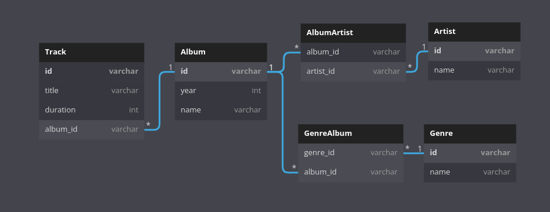

# Datamining @ ITC

### [GitHub link](https://github.com/ArnoBen/datamining_itc)

Datamining and webscraping project where we will perform webscraping on Discogs and use Spotify's API to build a music themed database.

We are using [this Discogs page](https://www.discogs.com/search/?sort=have%2Cdesc&ev=em_rs&type=master)
which provides a table of albums-artists ranked by most popular of all time (called "Most Collected").

We also registered to Spotify for Developers which provides a powerful API.

## Versions

- Python (3.9.12)
- BeautifulSoup4 (4.11.1)
- spotipy (2.20.0)
- Flask (2.1.2) ~ out of scope but fun embedding
- grequests (0.6.0)
- python-dotenv (0.20.0)

## How to use

- Using virtualenv:
 
0. virtualenv & activate
1. install the requirements.txt
2. `python3 spotify_server.py` # browser UI
3. `python3 discogs.py [count]` # discogs scraping

### Scraping Discogs

```
usage: main.py [-h] [-d] [-s] [-c COUNT] [-y YEAR] [-o CORES]

optional arguments:
  -h, --help            show this help message and exit
  -d, --debug           set log level to debug
  -s, --save            save the scraped information in a database
  -c COUNT, --count COUNT
                        amount of pages to scrape (default: 3)
  -y YEAR, --year YEAR  year of album release to filter
  -o CORES, --cores CORES
                        Amount of CPU cores to use for multiprocessed scraping
```

This will scrape the albums pages in discogs starting from [this page](https://www.discogs.com/search/?limit=50&sort=have%2Cdesc&ev=em_rs&type=master&layout=sm)

### Database Architecture



The database can be created by running the `create-db.sh` script in the sql folder.

### Spotify queries

:warning: This will NOT work without the environment variables `CLIENT_ID` and `CLIENT_SECRET` required to 
request Spotify's API. The .env file will be provided in the .zip submission.

- Run `python spotify_server.py` 
- Go to http://127.0.0.1:5000/
- Enter a Spotify search

We do not have defined a definite use for Spotify's API but it's good to have it available.
