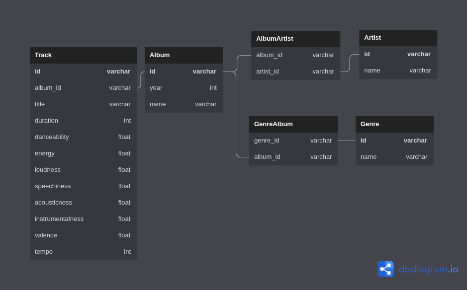

# Datamining @ ITC

### [GitHub link](https://github.com/ArnoBen/datamining_itc)

Datamining and webscraping project where we will perform webscraping on Discogs and use Spotify's API to build a music themed database.

We are using [this Discogs page](https://www.discogs.com/search/?sort=have%2Cdesc&ev=em_rs&type=master)
which provides a table of albums-artists ranked by most popular of all time (called "Most Collected").

We also registered to Spotify for Developers which provides a powerful API.

## Versions

- beautifulsoup4 (4.11.1)
- grequests (0.6.0)
- pymysql (1.0.2)
- python-dotenv (0.20.0)
- requests (2.28.1)
- urllib3 (1.26.9)
- spotipy (2.20.0)
- Flask (2.1.3) - out of scope but fun embedding


## How to use

Using virtualenv:
 
0. virtualenv & activate
1. install the requirements.txt
2. `python3 main.py [-h] [-d] [-s] [-c COUNT] [-y YEAR] [-o CORES] [-a] `, see chapter below for more information.
3. `python3 spotify_server.py` # browser UI

:warning: You will need the environment variables `MYSQL_PASSWORD` and `MYSQL_USER` to connect to mysql database.
Moreover, you will need `CLIENT_ID` and `CLIENT_SECRET` to request Spotify's API. The .env file will be provided in the .zip submission.

### Scraping Discogs

```
usage: main.py [-h] [-d] [-s] [-c COUNT] [-y YEAR] [-o CORES] [-a]

optional arguments:
  -h, --help            show this help message and exit
  -d, --debug           set log level to debug
  -s, --save            save the scraped information in a database
  -c COUNT, --count COUNT
                        amount of pages to scrape (default: 3)
  -y YEAR, --year YEAR  year of album release to filter
  -o CORES, --cores CORES
                        amount of CPU cores to use for multiprocessed scraping
                        (default: 4)
  -a, --api             saves additional data from Spotify api
```

This will scrape the albums pages in discogs starting from [this page](https://www.discogs.com/search/?limit=50&sort=have%2Cdesc&ev=em_rs&type=master&layout=sm)

:warning: `-a` is used for Spotify API calls, and arguments concerning Discogs scraping will be ignored. See Spotify part of the Readme.

### Database Architecture


*Generated from https://dbdiagram.io/d/62e28addf31da965e832fdce*

To build the database tables, run:
```commandline
mysql -u root -p < sql/create_music_tables.sql
```

Or run the provided script `create_db.sh` in the sql folder.

#### Descriptions

- **Album**
    - id: album id (hash)
    - year: album release year
    - name: album name
- **Artist**
    - id: artist id (hash)
    - name: artist name. A band is considered an artist.
- **Genre**
  - id: genre id (hash)
  - name: genre name. If an album has multiple genres like "Rock/Blues", this is not split and is considered a single genre.
- **Track**
  - title: track title
  - album_id: album in which this track belongs
  - id varchar track id (hash)
  - title: track title 
  - duration: track duration in seconds
  - danceability: track danceability (spotify)
  - energy: track energy (spotify) 
  - loudness: track loudness (spotify) 
  - speechiness: track speechiness (spotify) 
  - acousticness: track acousticness (spotify) 
  - instrumentalness: track instrumentalness (spotify)
  - valence: track valence (spotify), measure of happiness conveyed
  - tempo: track tempo (spotify)
- **AlbumArtist**: Table joining Album with Artist
  - album_id: album id
  - artist_id: artist id
- **GenreAlbum** Table joining Genre with Album
  - genre_id: genre id
  - artist_id: artist id

Nb: The object's ids are obtained with a custom deterministic hash using hashlib.md5.


### Spotify API calls

*Files related to Spotify API calls are located in the Spotify folder.*

usage : `python main.py -a`

This command fetches the tracks currently in the database and send queries to spotify following this pattern:
1. Send search query to spotify containing `[track_title] [album] [artist]`
2. Spotify provides json list containing track info. Keep id of 1st result.
3. Send audio track analysis query containing the id from 3.
4. Get features and update database for the associated track

Repeat 1-4 for each track in the database. It is slow but effective.

### Embedded spotify player

- Run `python spotify_server.py` 
- Go to http://127.0.0.1:5000/
- Enter a Spotify search

It's just a fun embedding for spotify's player widget.


# Redash visualization

This is the Redash dashboard created to display various visualizations of the scraped data.


